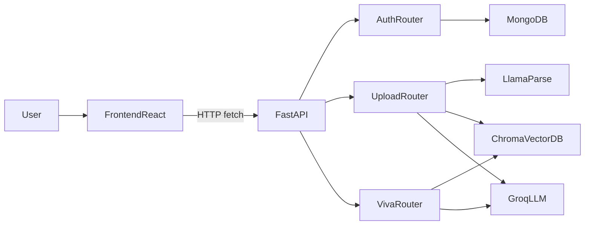

# Lexico Architecture Analysis

## High-Level Architecture
- The project is a React + Vite frontend and FastAPI backend split into `frontend` and `backend` workspaces.
- Frontend is a single-page state-driven UI (custom hooks + conditional rendering), not route-driven.
- Backend exposes REST APIs for auth, upload, and viva workflows; business logic is in service modules.
- Data storage is hybrid: MongoDB for users/auth data and local Chroma vector store for document embeddings/retrieval.
- AI pipeline uses LlamaParse (PDF extraction), LangChain chunk/vector retrieval, and Groq LLM for question generation/evaluation.

## Frontend Structure
- Entry/root:
  - [`frontend/src/main.jsx`](frontend/src/main.jsx): React bootstrap.
  - [`frontend/src/App.jsx`](frontend/src/App.jsx): top-level shell + auth gate (`if !token -> AuthScreen`).
- Core hooks:
  - [`frontend/src/hooks/useAuth.js`](frontend/src/hooks/useAuth.js): token persistence, login/register/logout, `/api/auth/me` profile hydration.
  - [`frontend/src/hooks/useUI.js`](frontend/src/hooks/useUI.js): modal/sidebar/view toggles.
  - [`frontend/src/hooks/useViva.js`](frontend/src/hooks/useViva.js): legacy upload + config flow via `/api/upload/`.
  - [`frontend/src/hooks/useVivaChat.js`](frontend/src/hooks/useVivaChat.js): viva setup Q/A + generate/evaluate loop.
- Main UI components:
  - [`frontend/src/components/MainScreen.jsx`](frontend/src/components/MainScreen.jsx): composes header + chat screen.
  - [`frontend/src/components/MainScreenComp/ChatScreen.jsx`](frontend/src/components/MainScreenComp/ChatScreen.jsx): `WelcomeScreen` vs `ChatInterface` switching.
  - [`frontend/src/components/MainScreenComp/InputArea.jsx`](frontend/src/components/MainScreenComp/InputArea.jsx): PDF upload to `/api/viva/upload`.
  - [`frontend/src/components/SlidebarComp/SettingsModal.jsx`](frontend/src/components/SlidebarComp/SettingsModal.jsx): settings container.
  - [`frontend/src/components/SlidebarComp/settings/TabAccount.jsx`](frontend/src/components/SlidebarComp/settings/TabAccount.jsx): account fetch/update/logout UI.

## Backend Architecture
- App lifecycle and router wiring:
  - [`backend/app/main.py`](backend/app/main.py): FastAPI app, CORS, Mongo connect/disconnect via lifespan, router inclusion.
- Auth layer:
  - [`backend/app/api/auth.py`](backend/app/api/auth.py): register/login/me/update endpoints.
  - [`backend/app/core/security.py`](backend/app/core/security.py): bcrypt hash/verify + JWT creation.
  - [`backend/app/models/user.py`](backend/app/models/user.py): Pydantic request/response models.
- Data and infra:
  - [`backend/app/core/database.py`](backend/app/core/database.py): Motor Mongo singleton (`get_db()`).
- Viva/upload AI pipelines:
  - [`backend/app/api/viva.py`](backend/app/api/viva.py): stateful `/upload`, `/generate`, `/evaluate` workflow.
  - [`backend/app/api/upload.py`](backend/app/api/upload.py): alternative upload endpoint using `main_process`.
  - [`backend/app/services/main_process.py`](backend/app/services/main_process.py): chunk -> filter -> vector search -> question generation.
  - [`backend/app/services/pdf_text_extractor.py`](backend/app/services/pdf_text_extractor.py): PDF text extraction.
  - [`backend/app/services/chunking_service.py`](backend/app/services/chunking_service.py): markdown chunking.
  - [`backend/app/services/vector_db.py`](backend/app/services/vector_db.py): Chroma + HuggingFace embeddings.
  - [`backend/app/services/ai_examiner.py`](backend/app/services/ai_examiner.py): Groq question generation.

## API Flow (Current)
1. Frontend uploads PDF (primarily `/api/viva/upload`; legacy flow uses `/api/upload/`).
2. Backend extracts text, chunks content, embeds chunks, stores vectors in Chroma.
3. Frontend starts viva and requests `/api/viva/generate` repeatedly with selected settings.
4. Backend fetches chunk context and asks LLM for one question JSON.
5. Frontend posts user answer to `/api/viva/evaluate`.
6. Backend evaluates answer using hidden context and returns score + feedback.
7. Frontend accumulates score/history and repeats until target question count.

## Authentication Flow (Current)
1. Register via `POST /api/auth/register`.
2. Login via `POST /api/auth/login`; backend returns bearer JWT.
3. Frontend stores token in `localStorage`.
4. On load/token change, frontend calls `GET /api/auth/me` to hydrate user.
5. Profile updates use `PUT /api/auth/update` with bearer token.
6. Logout clears token and user from frontend state.

## Database + Vector DB Flow
- MongoDB (`users` collection): user profile and hashed password only.
- Chroma (`./chroma_db`): embeddings for PDF chunks.
- In-memory state in viva router (`active_vector_store`, `pre_fetched_chunks`) tracks active interview context per process.
- AI context from vector retrieval is sent back into frontend (`hidden_context`) and reused for evaluation calls.

## How Frontend Communicates with Backend
- Direct `fetch` calls in hooks/components to hardcoded `http://localhost:8000` endpoints.
- JSON for auth/generate/evaluate; multipart form data for uploads.
- Auth header uses `Authorization: Bearer <token>` for protected endpoints.
- No centralized API client abstraction; request logic is duplicated across files.

## Important Folders/Files to Know First
- Frontend: [`frontend/src/components`](frontend/src/components), [`frontend/src/hooks`](frontend/src/hooks), [`frontend/src/App.jsx`](frontend/src/App.jsx)
- Backend API: [`backend/app/api`](backend/app/api), [`backend/app/main.py`](backend/app/main.py)
- Backend services: [`backend/app/services`](backend/app/services)
- Backend core infra: [`backend/app/core`](backend/app/core)
- Data contracts: [`backend/app/models`](backend/app/models)

## Weaknesses and Improvement Opportunities
- Hardcoded API base URL throughout frontend; should use env-based central API config.
- Two parallel upload/question pipelines (`/api/upload/` and `/api/viva/upload`) create duplication and drift risk.
- Auth consistency issue: mixed JWT libs (`jwt` vs `jose.jwt`) and mixed auth protection style (`Depends` vs manual header parsing).
- `register` endpoint response model mismatch (`response_model=UserResponse` but returns `{success: true}`) can cause validation/runtime issues.
- `SettingsModal` renders `TabAccount` without passing `auth`, while `TabAccount` expects it.
- Global mutable viva state on backend is unsafe for concurrent users/workers and may cause cross-user leakage.
- Token in `localStorage` increases XSS exposure; consider secure cookie/session strategy.
- Error handling is inconsistent (alerts, prints, broad exceptions), and many external calls run inline without background queue/retry strategy.
- No obvious test coverage around critical auth and viva flows.
- CORS/secrets/config are development-centric; production hardening is needed.

## Runtime Behavior Summary
- User authenticates, uploads PDF, backend builds semantic context, and app runs an AI viva loop of generate->answer->evaluate until completion.
- Frontend experience is driven by local React state transitions rather than URL-based routes.
- Backend currently prioritizes velocity and directness over strict separation, concurrency safety, and production-hardening patterns.